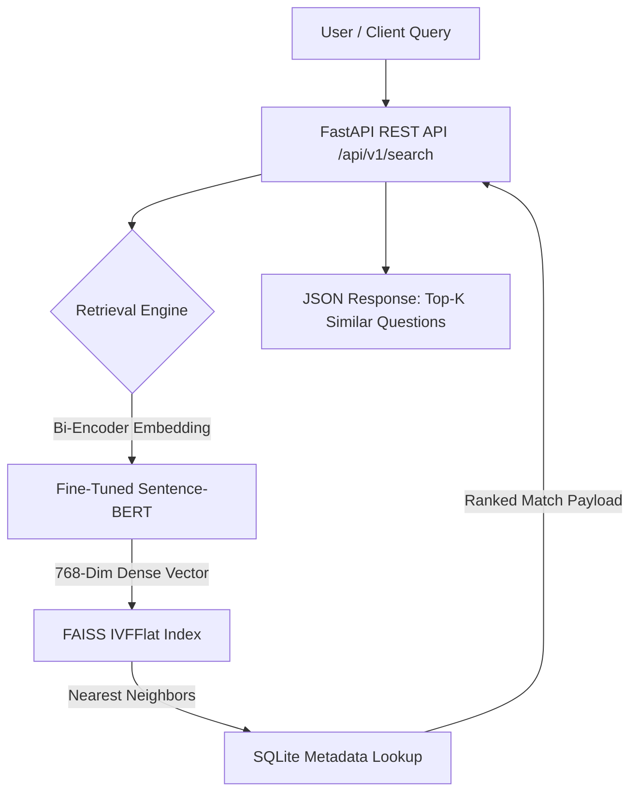

# dup-question-finder 🔍

> **Production-grade NLP pipeline for semantic duplicate question detection and sub-millisecond vector search using TF-IDF, XGBoost, fine-tuned Sentence-BERT, FAISS, and FastAPI.**

[](https://www.python.org/)
[](https://pytorch.org/)
[](https://www.sbert.net/)
[](https://github.com/facebookresearch/faiss)
[](https://fastapi.tiangolo.com/)
[](https://opensource.org/licenses/MIT)

---

## 📌 Executive Summary

`dup-question-finder` is a high-performance NLP application built to identify duplicate questions and perform real-time semantic similarity retrieval across large-scale text corpora. 

It implements a hybrid architecture combining a **classical feature-engineered ML baseline** (TF-IDF, Fuzzy Matching, XGBoost) and a **bi-encoder Sentence-BERT + FAISS vector search engine** exposed via a production-grade FastAPI microservice.

---

## 📊 Performance Benchmarks

### 1. Classical Baseline vs Fine-tuned Sentence-BERT

| Pipeline Component | Model / Architecture | Accuracy | Precision | Recall | F1-Score | AUC-ROC / AP |
| :--- | :--- | :---: | :---: | :---: | :---: | :---: |
| **Classical ML Baseline** | TF-IDF + Fuzzy Ratios + XGBoost | 72.00% | 0.5836 | 86.21% | 0.6960 | **0.8261 AUC** |
| **Deep Retrieval System** | Fine-tuned `all-mpnet-base-v2` | **84.00%** | **0.7205** | **89.20%** | **0.7970** | **82.75% AP** |

### 2. Feature Importance (XGBoost Baseline)
- `fuzz_token_set_ratio`: **40.3%**
- `fuzz_ratio`: **17.2%**
- `common_word_ratio`: **7.2%**
- `tfidf_cosine`: **7.0%**
- `fuzz_partial_ratio`: **6.3%**

---

## 🏗 System Architecture



---

## 📁 Repository Structure

```text
dup-question-finder/
├── api/                  # Production FastAPI microservice
│   ├── main.py           # Endpoint definitions & lifecycle events
│   └── schemas.py        # Pydantic request & response validation schemas
├── config.yaml           # Centralized configuration (paths, hyperparams)
├── data/                 # Data directory (.gitignore managed)
│   ├── faiss/            # FAISS vector index & SQLite metadata store
│   ├── models/           # Fine-tuned SBERT & XGBoost model artifacts
│   └── processed/        # Cleaned train, val, test & corpus parquets
├── src/                  # Core source codebase
│   ├── data/             # HuggingFace data loaders & text cleaning
│   ├── evaluation/       # Retrieval metrics (Recall@K, MRR, AUC)
│   ├── features/         # TF-IDF & fuzzy feature extraction pipeline
│   └── models/           # Baseline trainer & SBERT/FAISS pipeline
├── tests/                # Comprehensive unit & integration test suite
├── Dockerfile            # Containerization configuration
└── requirements.txt      # Python dependencies
```

---

## 🚀 Quickstart Guide

### 1. Environment Setup

```bash
# Clone the repository
git clone https://github.com/omm-prakash18/dup-question-finder.git
cd dup-question-finder

# Create & activate virtual environment
python -m venv .venv
.venv\Scripts\activate      # On Windows
# source .venv/bin/activate # On Linux/macOS

# Install dependencies
pip install -r requirements.txt
```

### 2. Run End-to-End Pipeline

```bash
# Step 1: Download & Clean HuggingFace QQP Dataset
python src/data/download_data.py
python src/data/preprocess.py

# Step 2: Train Classical Baseline Model (XGBoost)
python src/models/baseline.py

# Step 3: Fine-tune SBERT & Build FAISS Vector Index
python src/models/sbert_pipeline.py
```

### 3. Launch FastAPI Production Server

```bash
uvicorn api.main:app --host 0.0.0.0 --port 8000 --reload
```

Interactive API documentation available at: `http://localhost:8000/docs`

---

## 🧪 Testing & Validation

Run the complete test suite:

```bash
pytest
```

**Test Coverage**: **42 / 42 tests passing (100%)**
- `tests/test_api.py`: FastAPI endpoints, validation, 404 handlers.
- `tests/test_data.py`: Data leakage checks, null bounds, class balance.
- `tests/test_features.py`: TF-IDF sparse math, fuzzy overlap metrics.
- `tests/test_golden_set.py`: Regression testing on 25 curated pairs.
- `tests/test_metrics.py`: Classification & ranking metrics (Recall@K, MRR).
- `tests/test_model.py`: FAISS vector normalization & exact-match retrieval.

---

## 📜 License

Distributed under the MIT License. See `LICENSE` for details.
